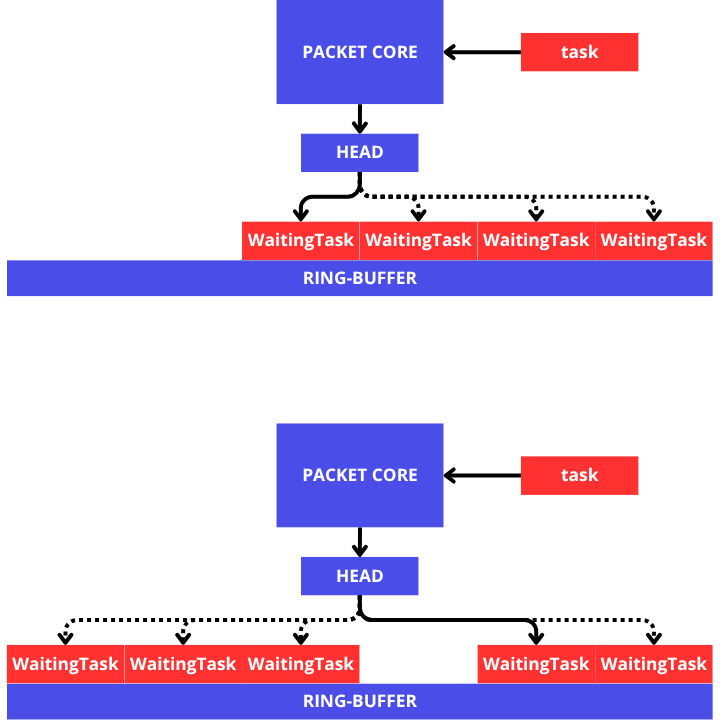
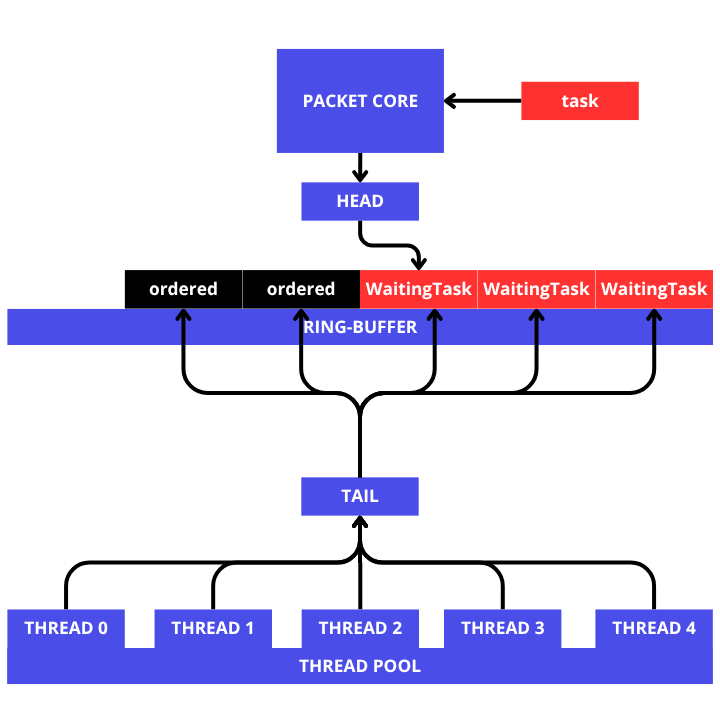

# Ring-Buffer
The spawned tasks will be placed and wait in the ring-buffer to be executed by threads in the thread pool.

    
The image above shows the mechanism by which tasks entering the packet-core become waiting tasks. The waiting task itself is placed in the ring buffer based on the head value it receives. Once the head reaches the end, it returns to the starting index.

In the case of a full ring-buffer, the packet-core will wait for the ring-buffer to have space for the next allocation, this will cause the main thread to block.

The image above shows how a thread in a thread pool retrieves a task from the ring buffer. The thread retrieves the index specified by the tail (using the atomic fetch add operation), and then retrieves the task at the index it retrieves. However, when the index passed the head index, the thread would not synchronize and would store the index and make it an "order" that would be checked periodically by the thread. When the packet-core fills the ordered index, the thread would immediately retrieve it without having to retrieve a new index from the tail.
