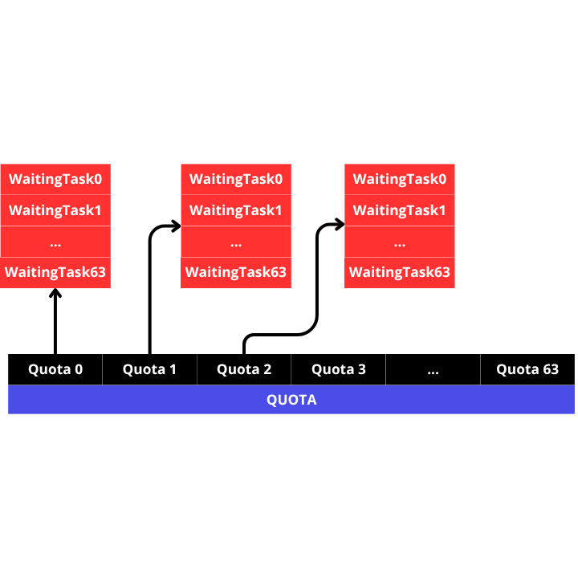
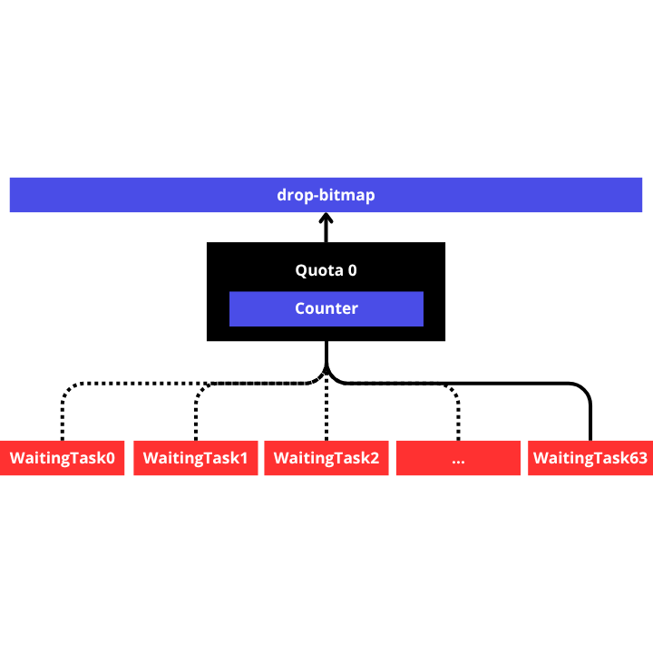

# Quota
Each spawned task will have a quota, which functions as a batching unit for cleaning tasks.
In version 0.2.0, the current quota is 64, and each quota can accommodate 64 tasks.

    
As can be seen in the image above, each task will have its own quota and every 64 tasks will have the same quota.

    
In the image above is the counter mechanism on the quota, each task that is completed will reduce the counter by 1, when the task that makes the quota counter become 0 then the thread that executes the task will update the drop-bitmap according to the index of the quota, by updating this drop-bitmap it indicates that all task return values will be deleted.

When a task is spawned but all quotas are full, packet-core will wait for an empty quota, causing the main thread to block. Packet-core mechanism for finding empty quotas is through the quota bitmap.
