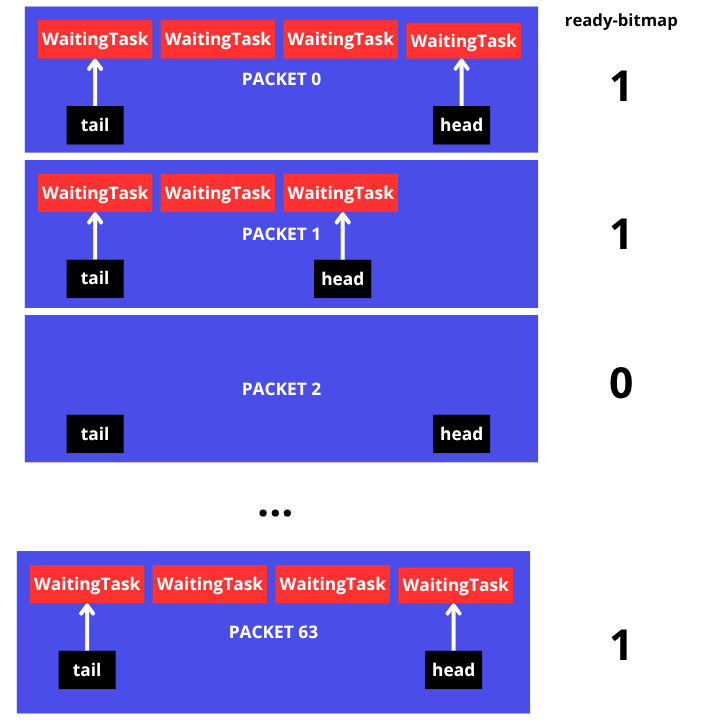
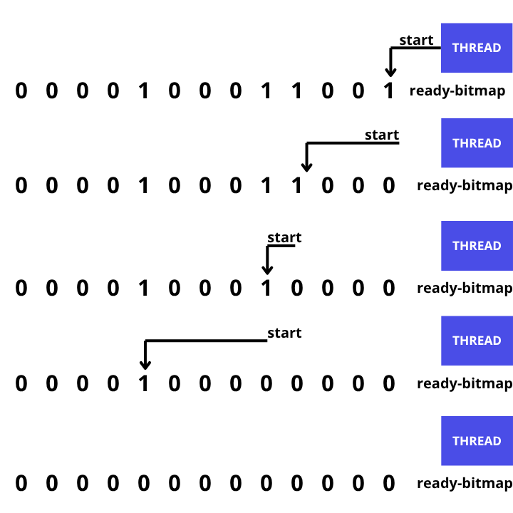
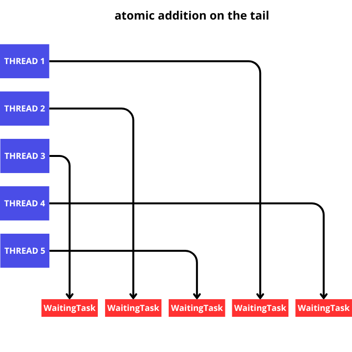

# Task Execution
In the packet there is a `task_list`, `tail` and `head`. To execute a task, the threads only need `task_list` and `tail`.
```
note:
The task also has a head, but the head functions for drop and packet-core.
```


    
The flow of the thread taking the task is:
1. The thread will check which packets are `ready` to be executed using `ready-bitmap`.
2. When a packet is encountered, the thread will immediately take one task using tail and the atomic `fetch_add` operation to avoid conflicts.
4. When a task reaches the end of the list, it immediately resets the `ready-bitmap` at the packet location.
5. When a thread has passed the end of the list (the end of the list here refers to the maximum capacity of the list, not the head), the thread will search for the next packet through the `ready-bitmap` again.

## packet search will continue to progress (next-fit)
Threads do not search from the same point each time. This increases collisions because many threads are searching in the same place, and tasks at the end of the packet will take a long time to execute because the packet-core packet will focus on fast searches. Therefore, the thread implements the next-fit concept where the thread will search at the position where it last received the packet.


The thread's search flow is described above. Searching uses direct bit operations, so there's no linear search.
When there are no more packets, the thread returns to its initial position.

## atomic operations
To avoid conflicts, `cahotic` uses an atomic addition operation based on the tail. They immediately get their positions because the index itself is unique and only one.


    
As can be seen above, if many threads are adding tails atomically, it will be a first come, first served basis and will result in non-sequential execution, but that is not a problem because executing tasks as quickly as possible is the essence of `cahotic`.
