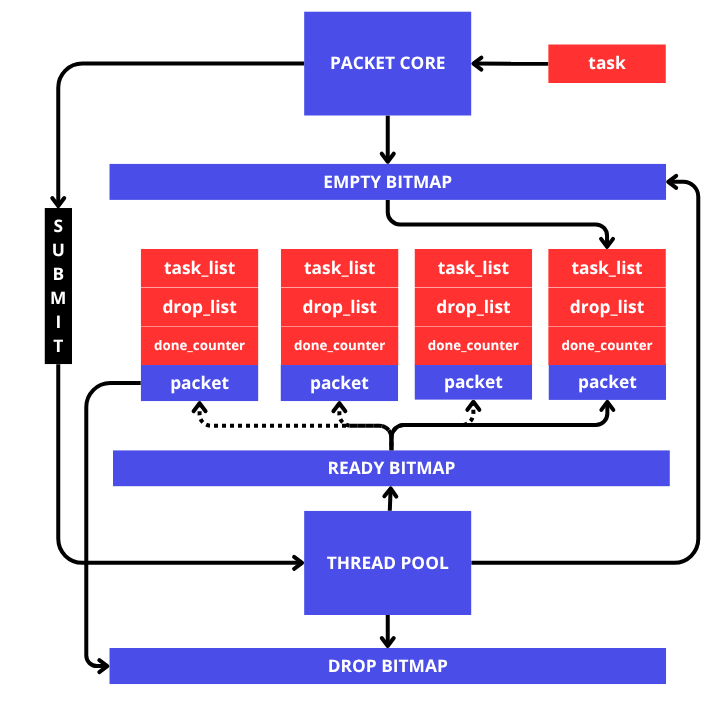

# Drop
pembersihan data task pada `cahotic` dilakukan secara serentak berdasarkan packet yang ia tempati. untuk memungkinkan drop, packet memiliki beberapa kompunent penting
1. `drop_list`, tempat dimana semua data task yang akan di drop.
2. `head`, sebagai batasan drop.
3. `done_counter`, untuk menjamin semua task selesai sebelum dihapus. ini penting terutama untuk scheduling.

secara singkat dapat dijelaskan seperti ini:
1. sebelum packet di submit, setiap task yang masuk akan diubah menjadi `WaitingTask` dan menambahkan `done_counter` pada packet yang menampungnya, `WaitingTask` menampung informasi-informasi yang dibituhkan, salah satunya adalah index dari packet yang `WaitingTask` itu tempati.
2. di saat `WaitingTask` selesai maka thread yang mengeksekusi `WaitingTask` akan langsung mengurangi `done_counter` dari packet yang telah diambil task di dalamnya.
3. saat `done_counter` menjadi 0, maka thread tersebut akan mengubah `drop-bitmap`, `drop-bitmap` sama dengan bitmap lainnya dengan fungsi khsusus yaitu untuk menandakan packet apa saja yang siap di drop.
4. drop-bitmap akan di check secara berkala secara cepat karena dalam bentuk bitmap, di saat ada packet yang bisa di drop melalui drop-bitmap, thread yang dapat duluan akan mengambilnya dan mulai melakukan drop pada packet tersebut.
5. di saat drop telah selesai, maka empty-bitmap akan di update sesuai dengan index packet telah di drop yang siap digunakan kembali menampung task yang baru.
