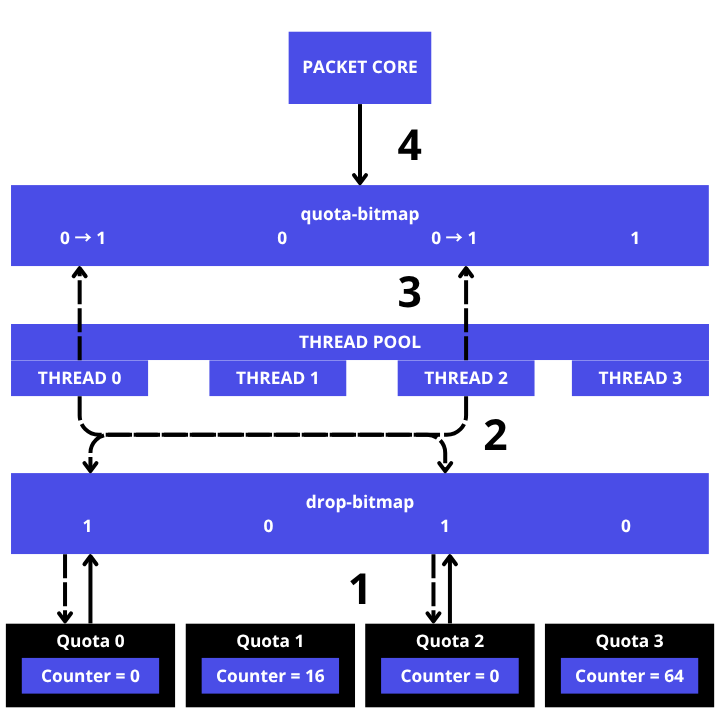

# Drop
Drop/cleaning on cahotic is done in batch on the same quota.

    
1. Starting when there's an empty quota, the thread will find it using a drop-bitmap. The quota-taking mechanism here is first-come, first-served.
2. The thread that is tasked with clearing the quota will immediately clear it.
3. After the thread has finished clearing the quota, the thread will immediately update the quota-bitmap based on the quota index that was cleared previously.
4. Packet-core will use packet-bitmap to get free quotas ready to accommodate spawned tasks.
