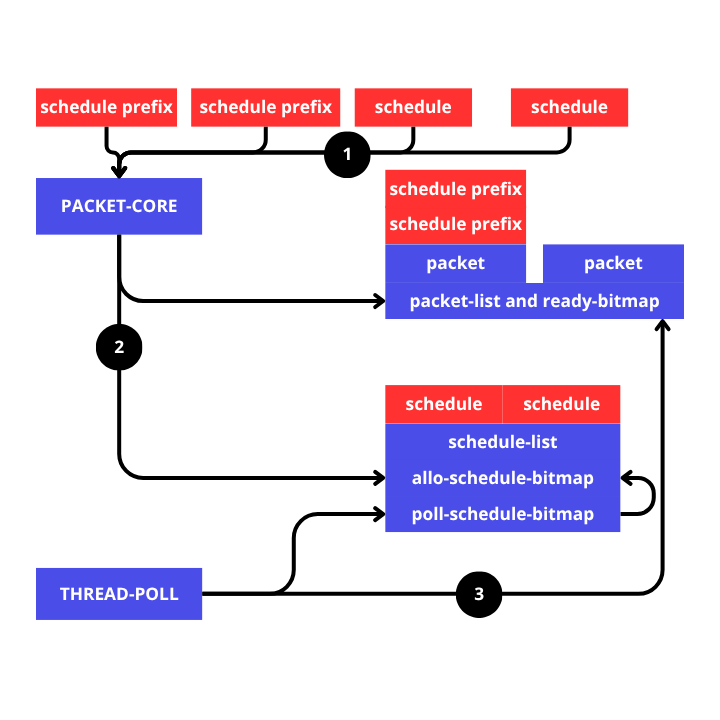

# Schedule Execution
```rust
fn main() {
    let cahotic = Cahotic::<MyTask, MyTask, MyOutput, 8, 16>::init();

    let mut poll1 = cahotic.scheduling_create_initial(MyTask::Task(|| {
        sleep(Duration::from_millis(1000));
        println!("task 1 done");
        MyOutput::Result(10)
    }));

    let mut poll2 = cahotic.scheduling_create_initial(MyTask::Task(|| {
        sleep(Duration::from_millis(500));
        println!("task 2 done");
        MyOutput::Result(20)
    }));

    // for poll3 to access the value of poll1 and the value of poll2. poll3 must first depend on poll1 and poll2
    let mut poll3 = cahotic.scheduling_create_schedule(MyTask::Schedule(|schedule_vec| {
        // in accessing the index, based on the scheduling order with poll1 and poll2
        let value_1 = schedule_vec.get(0);
        let value_2 = schedule_vec.get(1);
        println!(
            "task 3 done, value1: {:?} and value: {:?}",
            value_1, value_2
        );
        MyOutput::None
    }));

    // scheduling order will affect the index accessing poll1 and poll2 by poll3
    cahotic.schedule_after(&mut poll3, &mut poll1).unwrap(); // index 0
    cahotic.schedule_after(&mut poll3, &mut poll2).unwrap(); // index 1

    cahotic.schedule_exec(poll3);
    cahotic.schedule_exec(poll2);
    cahotic.schedule_exec(poll1);

    cahotic.submit_packet();

    cahotic.join();
}
```
From the code above it can be concluded:
1. schedule prefixes are poll1 and poll2.
2. schedule poll3 depends on poll1 and poll2.


begins by creating an initial schedule that is created using `Cahotic::scheduling_create_initial(&self, F)`
```rust
let mut poll1 = cahotic.scheduling_create_initial(MyTask::Task(|| {
    sleep(Duration::from_millis(1000));
    println!("task 1 done");
    MyOutput::Result(10)
}));

let mut poll2 = cahotic.scheduling_create_initial(MyTask::Task(|| {
    sleep(Duration::from_millis(500));
    println!("task 2 done");
    MyOutput::Result(20)
}));
```
`poll1` and `poll2` will have a value of type `Schedule<F, FS, O>`
```
note:
- F: Type that implements TaskTrait (for regular tasks)
- FS: Type that implements SchedulerTrait (for scheduled tasks with dependencies)
- O: Type that implements OutputTrait (return value of tasks)
```
When creating the initial schedule, no changes are made to `cahotic`. Here, we only create the `Schedule` data type, which will first collect all interactions and then be executed by `cahotic` via:
```rust
cahotic.schedule_exec(poll2); // → go directly to the packet task list
cahotic.schedule_exec(poll1); // → go directly to the packet task list
```

for normal schedule, create it via `Cahotic::scheduling create schedule(&self, FS)`
```rust
let mut poll3 = cahotic.scheduling_create_schedule(MyTask::Schedule(|schedule_vec| {
    let value_1 = schedule_vec.get(0);
    let value_2 = schedule_vec.get(1);
    println!(
        "task 3 done, value1: {:?} and value: {:?}",
        value_1, value_2
    );
    MyOutput::None
}));
```
The code above will immediately allocate space on the `schedule_list` which is waiting inside until it is ready to be executed, The `schedule list` itself can accommodate 64 schedules at one time. If the `schedule_list` is full, the `packet-core` will experience blocking until there is free space in the `schedule_list`. `packet-core` allocates schedules on `schedule_list` using `allo-schedule-bitmap`, the mechanism is similar to `packet-core` searching for packets via `empty-bitmap`.

The threads in the thread pool also periodically perform a quick check to see if there are any scheduled tasks ready for execution using `poll-schedule-bitmap`, a mechanism similar to `drop-bitmap` and `ready-bitmap`.

```rust
cahotic.schedule_after(&mut poll3, &mut poll1).unwrap();
cahotic.schedule_after(&mut poll3, &mut poll2).unwrap();
```
In this line, poll3 will be executed when poll1 and poll2 have finished executing. Technically, poll3 has a `poll_counter` which will increase as poll3 is scheduled, and poll1 and poll2 will also store poll3's `poll_counter`.

```rust
cahotic.schedule_exec(poll3); // → enter the schedule list, waiting for the counter
cahotic.schedule_exec(poll2); // → go directly to the packet task list
cahotic.schedule_exec(poll1); // → go directly to the packet task list

cahotic.submit_packet();
```
In the line above, all schedules created must be executed. The mechanism is in accordance with the explanation in [2_schedule.md](2_schedule.md).
for initial schedule and normal schedule have different handling when executed, The initial schedule is still the same as a regular task, but the only difference is in the handling of the counter after execution, but the normal schedule is actually sent directly to the `schedule_list` not to the `task-list` in the packet, but the packet still calculates it and assumes there is a task there, This is needed for the drop schedule later, which will also be dropped along with other tasks in the packet.

In the code example above, poll3 has a `poll_counter` value of 2 and when poll2 is finished, the thread executing poll2 will reduce the `poll_counter` and the thread completing poll1 will also reduce the `poll_counter` so that the `poll_counter` has a value of 0. at that time the thread that gets `poll_counter` == 0 will activate the bitmap on `poll-schedule-bitmap` according to the index occupied by the poll3 schedule.

`poll-schedule-bitmap` will be periodically checked quickly by the threads on the poll thread, still using the same concept as the drop mechanism on `drop-bitmap`, the thread that gets the signal from `poll-schedule-bitmap` will execute the schedule on `schedule_list` and then after that will update `allo-schedule-bitmap` to be allocated by `packet-core` for the new schedule.


    
explanation:
1. The normal schedule and initial schedule that have been created are executed into `packet-core`
2. `packet-core` will process the schedule and place it into the `task-list` in the packet and the `schedule-list` in `packet-core`. For normal schedules, they are still assumed to be in the packet but are physically included in the `schedule-list`.
3. The threads in the thread pool will execute the ready packets and then when the thread finds the `poll_counter`, the thread will immediately update the `poll-schedule-bitmap`. Threads will also periodically check `poll-schedule-bitmap` to execute schedules that are ready to be executed.
