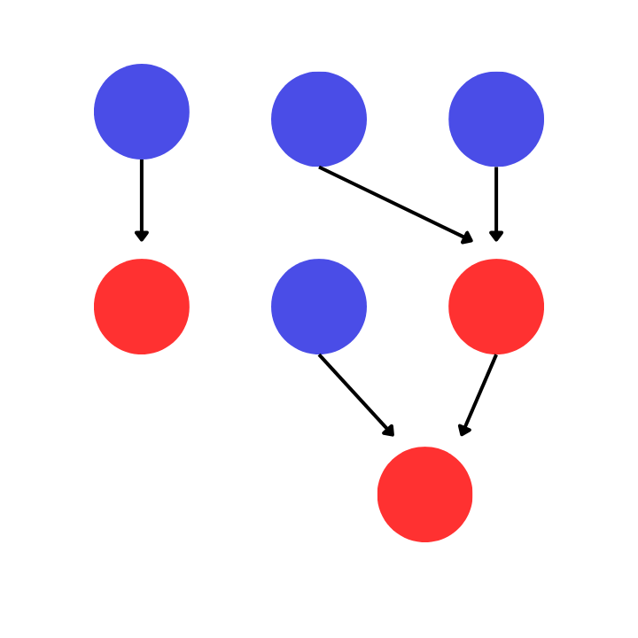
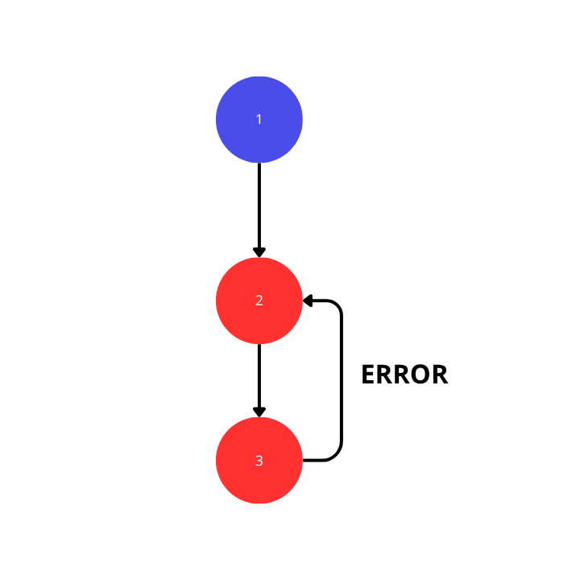

# Scheduling
`schedule` berfungsi menjadwalkan sebuah task dan cara bagaimana cara task saling berkomunikasi.
``` rust
use std::{thread::sleep, time::Duration};

use cahotic::{Cahotic, OutputTrait, ScheduleVec, SchedulerTrait, TaskTrait};

#[derive(Debug)]
enum MyOutput {
    Result(i32),
    None,
}
impl OutputTrait for MyOutput {}

enum MyTask {
    Task(fn() -> MyOutput),
    Schedule(fn(scheduler_vec: ScheduleVec<MyOutput>) -> MyOutput),
}

impl TaskTrait<MyOutput> for MyTask {
    fn execute(&self) -> MyOutput {
        match self {
            MyTask::Task(f) => f(),
            MyTask::Schedule(_) => MyOutput::None,
        }
    }
}

impl SchedulerTrait<MyOutput> for MyTask {
    fn execute(&self, scheduler_vec: ScheduleVec<MyOutput>) -> MyOutput {
        match self {
            MyTask::Task(_) => MyOutput::None,
            MyTask::Schedule(f) => f(scheduler_vec),
        }
    }
}

fn main() {
    let cahotic = Cahotic::<MyTask, MyTask, MyOutput, 8, 16>::init();

    // Scheduling 
    let mut poll1 = cahotic.scheduling_create_initial(MyTask::Task(|| {
        sleep(Duration::from_millis(1000));
        println!("task 1 done");
        MyOutput::None
    }));

    let mut poll2 = cahotic.scheduling_create_schedule(MyTask::Schedule(|_| {
        println!("task 2 done");
        MyOutput::None
    }));

    cahotic.schedule_after(&mut poll2, &mut poll1).unwrap();

    cahotic.schedule_exec(poll2);
    cahotic.schedule_exec(poll1);

    cahotic.submit_packet();

    cahotic.join();
}
```

penjelasan:
```rust
let mut poll1 = cahotic.scheduling_create_initial(MyTask::Task(|| {
    sleep(Duration::from_millis(1000));
    println!("task 1 done");
    MyOutput::None
}));

let mut poll2 = cahotic.scheduling_create_schedule(MyTask::Schedule(|_| {
    println!("task 2 done");
    MyOutput::None
}));
```
disini menggunakan 2 method antara lain:
`Cahotic::scheduling_create_initial(&self, F)`
dan
`Cahotic::scheduling_create_schedule(&self, FS)`
```
note:
- F: Type that implements TaskTrait (for regular tasks)
- FS: Type that implements SchedulerTrait (for scheduled tasks with dependencies)
```
untuk memahami ini, sebaiknya kita memahami bagaimana konsep Scheduling pada `cahotic`.

## `cahotic` menggunakan konsep `DAG (Directional Acyclic Graph)`



bisa dilihat gambar diatas, ada node berwarna biru dan merah. node berwarna biru adalah node yang menjadi awal dan node yang berwarna merah adalah node yang telah di jadwalkan dengan node biru atau node merah. berdasarkan node merah dan biru, maka:
`Cahotic::scheduling_create_initial(&self, F)`
berguna untuk membuat initial schedule dari graph yang tidak dapat di jadwalkan.
`Cahotic::scheduling_create_schedule(&self, FS)`
berguna untuk membuat normal schedule yang dapat di jadwalkan oleh task(node biru) atau schedule lainnya(node merah).

oleh karena itu aturan pertama dari scheduling pada `cahotic`: 
*setiap initital schedule(node biru) tidak dapat memiliki dependensi (hanya bisa menjadi dependensi schedule lain).*

setiap relasi yang tercipta pada task harus mengikuti konsep `DAG`, yaitu tidak boleh adanya siklus di dalam graf tersebut.
```rust
fn main() {
    let cahotic = Cahotic::<MyTask, MyTask, MyOutput, 8, 16>::init();

    let mut poll1 = cahotic.scheduling_create_initial(MyTask::Task(|| {
        sleep(Duration::from_millis(1000));
        println!("task 1 done");
        MyOutput::None
    }));

    let mut poll2 = cahotic.scheduling_create_schedule(MyTask::Schedule(|_| {
        println!("task 2 done");
        MyOutput::None
    }));

    cahotic.schedule_after(&mut poll2, &mut poll1).unwrap();

    let mut poll3 = cahotic.scheduling_create_schedule(MyTask::Schedule(|_| {
        println!("task 3 done");
        MyOutput::None
    }));

    // terjadi siklus disini, menyebabkan task ini `cahotic` tersangkut
    cahotic.schedule_after(&mut poll3, &mut poll2).unwrap();
    cahotic.schedule_after(&mut poll2, &mut poll3).unwrap();

    cahotic.schedule_exec(poll3);
    cahotic.schedule_exec(poll2);
    cahotic.schedule_exec(poll1);

    cahotic.submit_packet();

    cahotic.join();
}
```
bisa dilihat pada baris ini
```rust
cahotic.schedule_after(&mut poll3, &mut poll2).unwrap();
cahotic.schedule_after(&mut poll2, &mut poll3).unwrap();
```
terjadinya siklus disini, menyebabkan task ini akan tersangkut pada `cahotic`.


    
oleh karena itu aturan kedua dari scheduling pada `cahotic`: 
*tidak boleh ada 2 schedule atau lebih yang saling menjadwalkan(membentuk siklus).*

pada code di bawah ini
```rust
cahotic.schedule_exec(poll3);
cahotic.schedule_exec(poll2);
cahotic.schedule_exec(poll1);

cahotic.submit_packet();

cahotic.join();
```
semua initial schedule dan schedule yang telah di buat, maka harus dieksekusi melalui method `Cahotic::schedule_exec(&self, Schedule)` yang akan mereturn `PollWaiting`. secara teknis, yang terjadi saat melakukan penjadwalan adalah keseluruhan schedule akan mengupdate `cahotic` berdasarkan penjadwalan yang telah di tetapkan, jika ada 3 schedule namun hanya di eksekusi 2. maka schedule yang tidak di eksekusi menyebabkan schedule tersebut bisa tersangkut di `cahotic` dan bahkan lebih buruk yaitu mekanisme pembersihan `cahotic` yang tersangkut.

namun jika ada 3 schedule yang dibuat, namun tidak ada satupun yang di eksekusi? itu masihlah menjadi masalah karena pada method ini
`Cahotic::scheduling_create_schedule(&self, FS)`
langsung mengalokasikan space di dalam `cahotic`, jika tidak ada satupun schedule yang di eksekusi maka tidak ada satupun schedule yang menangani handler untuk mengalokasikan kembali space yang telah di tempati ini, dengan kata lain schedule akan tersangkut.

oleh karena itu aturan ketiga dari scheduling pada `cahotic`: 
*Semua Schedule yang telah dibuat haruslah di eksekusi*


## Communication Between Schedules
mari kita melihat baris ini:
```rust
impl SchedulerTrait<MyOutput> for MyTask {
    fn execute(&self, scheduler_vec: ScheduleVec<MyOutput>) -> MyOutput {
        match self {
            MyTask::Task(_) => MyOutput::None,
            MyTask::Schedule(f) => f(scheduler_vec),
        }
    }
}
```
terdapat struct `ScheduleVec<MyOutput>`, ini akan menampung semua value yang di return oleh schedule yang dipergantungkan.
```rust
fn main() {
    let cahotic = Cahotic::<MyTask, MyTask, MyOutput, 8, 16>::init();

    let mut poll1 = cahotic.scheduling_create_initial(MyTask::Task(|| {
        sleep(Duration::from_millis(1000));
        println!("task 1 done");
        MyOutput::Result(10)
    }));

    let mut poll2 = cahotic.scheduling_create_initial(MyTask::Task(|| {
        sleep(Duration::from_millis(500));
        println!("task 2 done");
        MyOutput::Result(20)
    }));

    // untuk poll3 dapat mengakses value poll1 dan value poll2. poll3 harus ketergantungan terlebih dahulu dengan poll1 dan poll2
    let mut poll3 = cahotic.scheduling_create_schedule(MyTask::Schedule(|schedule_vec| {
        // dalam mengakses index, bersarkan dari urutan penjadwalan dengan poll1 dan poll2
        let value_1 = schedule_vec.get(0);
        let value_2 = schedule_vec.get(1);
        println!(
            "task 3 done, value1: {:?} and value: {:?}",
            value_1, value_2
        );
        MyOutput::None
    }));

    // urutan penjadwalan akan mempengaruhi index mengakses poll1 dan poll2 oleh poll3 
    cahotic.schedule_after(&mut poll3, &mut poll1).unwrap(); // index 0
    cahotic.schedule_after(&mut poll3, &mut poll2).unwrap(); // index 1

    cahotic.schedule_exec(poll3);
    cahotic.schedule_exec(poll2);
    cahotic.schedule_exec(poll1);

    cahotic.submit_packet();

    cahotic.join();
}
```
pada bagian baris ini
```rust
// untuk poll3 dapat mengakses value poll1 dan value poll2. poll3 harus ketergantungan terlebih dahulu dengan poll1 dan poll2
let mut poll3 = cahotic.scheduling_create_schedule(MyTask::Schedule(|schedule_vec| {
    // dalam mengakses index, bersarkan dari urutan penjadwalan dengan poll1 dan poll2
    let value_1 = schedule_vec.get(0);
    let value_2 = schedule_vec.get(1);
    println!(
        "task 3 done, value1: {:?} and value: {:?}",
        value_1, value_2
    );
    MyOutput::None
}));

// urutan penjadwalan akan mempengaruhi index mengakses poll1 dan poll2 oleh poll3 
cahotic.schedule_after(&mut poll3, &mut poll1).unwrap(); // index 0
cahotic.schedule_after(&mut poll3, &mut poll2).unwrap(); // index 1
```
diperlukannya penentuan struktur secara eksplisit, ini adalah aturan ke-4 dari scheduling:
*untuk mengakses value return dari value schedule yang menjadi dependensi, harus sesuai dengan urutan penjadwalannya*

sebagai tambahan, pada baris ini:
```rust
cahotic.schedule_exec(poll3);
cahotic.schedule_exec(poll2);
cahotic.schedule_exec(poll1);
```
urutan eksekusi sebenarnya tidak masalah untuk acak, namun jika berurutan yang mana penjadwalan terdalam di eksekusi terlebih dahulu hingga paling atas(berdasarkan grafik yang terbentuk), sehingga akan lebih optimal karena tidak ada error handling saat shcedule telah selesai namun schedule yang ketergantungannya dengannya masih belum masuk ke dalam thread pool.

ini akan menjadi aturan ke-5, bukan untuk menghindari error. namun untuk optimalisasi
*penjadwalan terdalam di eksekusi terlebih dahulu hingga paling atas(berdasarkan grafik yang terbentuk), sehingga akan lebih optimal*

## limitations due to design and capacity
`cahotic` akan mengalokasikan space untuk normal schedule, dikarenakan desain system dan batas penyimpanan yang hanya dapat menampung 64 schedule. maka di saat ada lebih dari 64 schedule di spawn pada satu waktu, maka `cahotic` akan tersangkut.

maka ini menjadi aturan ke-6.
*jangan membuat lebih dari 64 schedule dalam satu waktu*

jika ada normal schedule yang di eksekusi tanpa adanya dependensi, maka schedule tersebut masih bisa di eksekusi namun ada cost untuk menghandle nya, lebih baik gunakan initial schedule.
```rust
fn main() {
    let cahotic = Cahotic::<MyTask, MyTask, MyOutput, 8, 16>::init();

    // poll masih akan dieksekusi namun memiliki cost untuk penanganannya, gunakan initial schedule.
    let poll = cahotic.scheduling_create_schedule(MyTask::Schedule(|_| {
        println!("task done");
        MyOutput::None
    }));

    cahotic.schedule_exec(poll);
    cahotic.submit_packet();

    cahotic.join();
}
```
oleh karena itu, ini menjadi aturan ke-7 dan ke-8
7. *setiap scheduling haruslah diawali dengan initial schedule*
8. *hindari membuat normal shcedule yang dibuat tanpa ketergantungan*

## 8 Aturan, cukup banyak? aku setuju
maka dalam Scheduling pada `cahotic` terdapat total 8 aturan, diantaranya:
1. *setiap initital schedule(node biru) tidak dapat memiliki dependensi (hanya bisa menjadi dependensi schedule lain).**
2. *tidak boleh ada 2 schedule atau lebih yang saling menjadwalkan(membentuk siklus).*
3. *Semua Schedule yang telah dibuat haruslah di eksekusi.*
4. *untuk mengakses value return dari value yang menjadi dependensi, harus sesuai dengan urutan penjadwalannya*
5. *penjadwalan terdalam di eksekusi terlebih dahulu hingga paling atas(berdasarkan grafik yang terbentuk), sehingga akan lebih optimal*
6. *jangan membuat lebih dari 64 schedule dalam satu waktu*
7. *setiap scheduling haruslah diawali dengan initial schedule*
8. *hindari membuat normal shcedule yang dibuat tanpa ketergantungan*
jika tidak diikuti maka akan menyebabkan kasus-kasus yang masih belum dapat di handle oleh cahotic. kerena itu diminta untuk berhati-hati.
