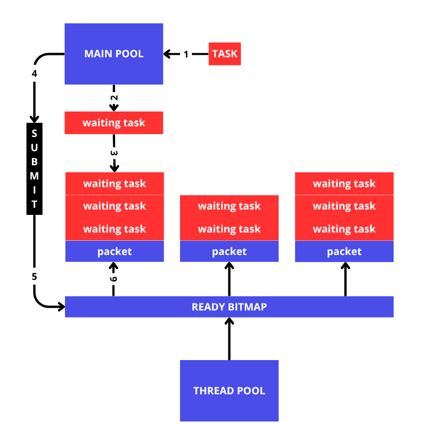
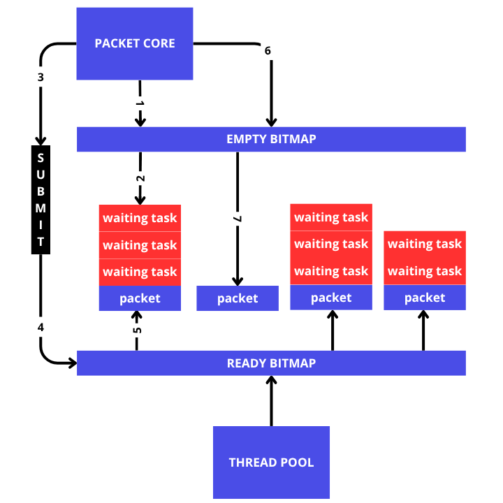

# Packet
```rust
fn main() {
    let cahotic = Cahotic::<MyTask, MyTask, MyOutput, 8, 16>::init();

    cahotic.spawn_task(MyTask::Task(|| {
        sleep(Duration::from_millis(1000));
        println!("1 done!");
        MyOutput::None
    }));

    cahotic.spawn_task(MyTask::Task(|| {
        sleep(Duration::from_millis(500));
        println!("2 done!");
        MyOutput::None
    }));

    cahotic.submit_packet();

    cahotic.join();
}
```
pada code diatas, cahotic tidak akan langsung mengirim task yang telah disepawn ke dalam thread pool, namun di masukkan terlebih dahulu ke dalam `packet`.


    
penjelasan:
1. task dibuat terlebih dahulu
```rust
MyTask::Task(|| {
    sleep(Duration::from_millis(1000));
    println!("1 done!");
    MyOutput::None
}
```
2. menggunakan method `Cahotic::spawn_task(&self, F)`. untuk membuat menjadikannya `WaitingTask`.
```rust
cahotic.spawn_task(MyTask::Task(|| {
    sleep(Duration::from_millis(1000));
    println!("1 done!");
    MyOutput::None
}));
```
3.  Waiting Task tidak langsung di eksekusi ke dalam thread pool, namun harus menunggu dan di kumpulkan ke dalam packet, jadi thread pool akan menerima task dalam kumpulan batch.
4. menggunakan method `Cahotic::submit_packet(&self)`
```rust
cahotic.submit_packet();
```
5. saat submit, sebenarnya tidak mengirim packet ke thread pool, namun akan update `ready-bitmap`, `ready-bitmap` adalah bitmap yang berfungsi untuk menjadi pemetaan serta sebagai pemberi status, penggunaan bitmap di gunakan karena ringan namun dapat melakukan scanning dengan cepat.
6. di saat `ready-bitmap` di update yang awalnya 0 menjadi 1, maka thread pool dapat mengeksekusinya.

di saat submit main thread akan langsung mencari packet yang kosong untuk dijadikan penampung task-task yang akan datang selanjutnya.


    
gambar diatas, kita mengganti `main pool` menjadi `packet-core`. secara keseluruhan sama dengan penjelasan diatas, namun secara teknis penamaan pada `cahotic` yang mengurus semua administrasi packet disebut `packet-core`.
penjelasannya
1. `packet-core` saat awal inisialisasi tidak menunjuk pada packet apapun. oleh karena itu `packet-core` akan mencari packet yang kosong menggunakan `empty-bitmap`.
2. disaat `packet-core` menemukan packet yang kosong, packet itulah yang akan menampung task-task yang akan masuk.
3. packet di `submit`
4. `packet-core` akan update ready-bitmap.
5. `thread pool` akan mengechek bitmap tersebut dan mendapatkan informasi dimana lokasi dan status dari packet tersebut.
6. `packet-core` kini tidak memiliki packet tujuan, oleh karena itu `packet-core` akan mencari packet yang kosong.
7. setelah packet kosong di temukan, maka `packet-core` akan menjadikannya penampung untuk task-task yang akan datang.

`packet-core` memiliki 64 packet yang masing-masing kapasitasnya dapat diataur melalui notasi daat inisialisasi `Cahotic`
```
Cahotic::<F, FS, O, N, PN>::init();
Cahotic generic parameters:
- F: Type that implements TaskTrait (for regular tasks)
- FS: Type that implements SchedulerTrait (for scheduled tasks with dependencies)
- O: Type that implements OutputTrait (return value of tasks)
- N: Number of worker threads (const generic)
- PN: Packet capacity — maximum tasks per packet (const generic)
```
berdasarkan code struktur inisialisasi diatas, kapasitas dari packet dapat diatur melalui `PN`

note!: ada beberapa kondisi khusus dari `packet-core` ini
1. jika packet penuh lalu ada task yang masuk, maka `packet-core` akan secara otomatis submit packet tersebut dan mencari packet kosong.
2. jika `packet-core` mencari packet kosong, namun mendapati seluruh packet penuh, maka akan terjadinya blocking disini hingga `packet-core` mendapatkan packet yang kosong.

sebagai informasi tambahan, packet disimpan di sebuah array sebesar 64, oleh karena itu `empty-bimtap` dan `ready-bimtap` akan berukuran 64 bit yang berguna bukan hanya mendapatkan status namun juga sekaligus mendapatkan posisi secara cepat.
contoh
```
[empty, empty, ready, empty, ready, ready]
empty-bimtap: 110100
ready-bimtap: 001011
```

ada kasus khusus untuk `scheduling`, initial `schedule` masih akan tetap tertampung ke dalam packet, namun normal schedule akan dinaggap ikut tertampung ke dalam packet, namun hanya sekedar untuk ikut dibersihkan. Secara teknis schedule akan masuk ke dalam `schedule-list`. kita akan bahas ini nanti.
