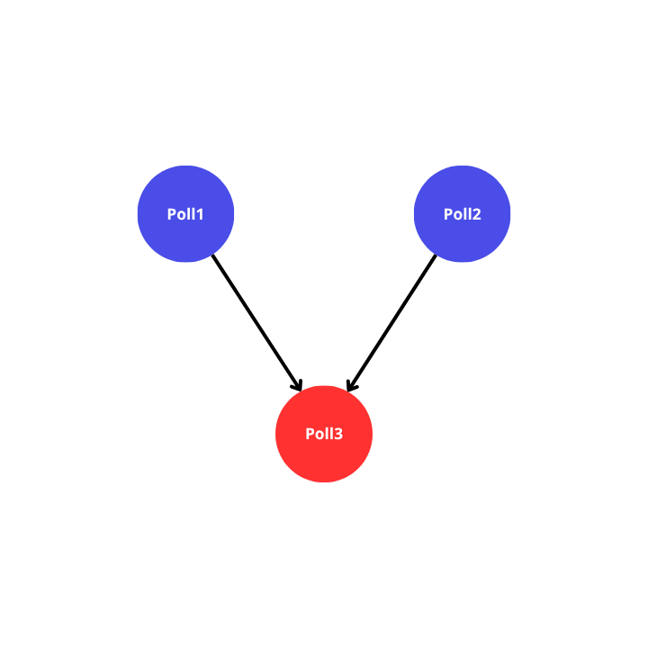
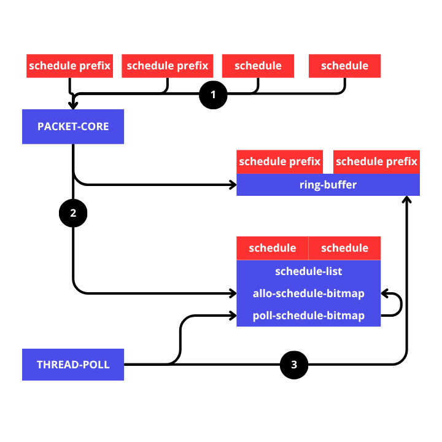

# Schedule Execution
```rust
use std::{thread::sleep, time::Duration};

use cahotic::{CahoticBuilder, DefaultOutput, DefaultSchedule, DefaultTask};

fn main() {
    let cahotic = CahoticBuilder::default().build().unwrap();

    let mut poll1 = cahotic.scheduling_create_initial(DefaultTask(|| {
        sleep(Duration::from_millis(1000));
        println!("task 1 done");
        DefaultOutput(10)
    }));

    let mut poll2 = cahotic.scheduling_create_initial(DefaultTask(|| {
        sleep(Duration::from_millis(500));
        println!("task 2 done");
        DefaultOutput(20)
    }));

    // untuk poll3 dapat mengakses value poll1 dan value poll2. poll3 harus ketergantungan terlebih dahulu dengan poll1 dan poll2
    let mut poll3 = cahotic.scheduling_create_schedule(DefaultSchedule(|schedule_vec| {
        // dalam mengakses index, bersarkan dari urutan penjadwalan dengan poll1 dan poll2
        let value_1 = schedule_vec.get(0).unwrap();
        let value_2 = schedule_vec.get(1).unwrap();
        println!(
            "task 3 done, value1: {:?} and value: {:?}",
            value_1.0, value_2.0
        );
        DefaultOutput(30)
    }));

    // urutan penjadwalan akan mempengaruhi index mengakses poll1 dan poll2 oleh poll3
    cahotic.schedule_after(&mut poll3, &mut poll1).unwrap(); // index 0
    cahotic.schedule_after(&mut poll3, &mut poll2).unwrap(); // index 1

    cahotic.schedule_exec(poll3);
    cahotic.schedule_exec(poll2);
    cahotic.schedule_exec(poll1);

    cahotic.join();
}
```
dari code diatas dapat disimpulkan:
1. initial schedule adalah poll1 dan poll2.
2. schedule poll3 bergantung kepada poll1 dan poll2.



diawali dengan membuat initial schedule yang dibuat menggunakan `Cahotic::scheduling_create_initial(&self, F)`
```rust
let mut poll1 = cahotic.scheduling_create_initial(DefaultTask(|| {
    sleep(Duration::from_millis(1000));
    println!("task 1 done");
    DefaultOutput(10)
}));

let mut poll2 = cahotic.scheduling_create_initial(DefaultTask(|| {
    sleep(Duration::from_millis(500));
    println!("task 2 done");
    DefaultOutput(20)
}));
```
`poll1` dan `poll2` akan memiliki value bertipe `Schedule<F, FS, O>`
```
note:
- F: Type that implements TaskTrait (for regular tasks)
- FS: Type that implements SchedulerTrait (for scheduled tasks with dependencies)
- O: Type that implements OutputTrait (return value of tasks)
```
saat membuat initial schedule, tidak ada perubahan yang terjadi pada cahotic. disini hanyalah membuat type data `Schedule` saja yang akan mengumpulkan segala interaksi terlebih dahulu dan baru akan dieksekusi oleh `cahotic` melalui:
```rust
cahotic.schedule_exec(poll2); // → langsung masuk ke ring-buffer
cahotic.schedule_exec(poll1); // → langsung masuk ke ring-buffer
```

untuk normal shcedule, membuatnya melalui `Cahotic::scheduling_create_schedule(&self, FS)`
```rust
let mut poll3 = cahotic.scheduling_create_schedule(DefaultSchedule(|schedule_vec| {
    // dalam mengakses index, bersarkan dari urutan penjadwalan dengan poll1 dan poll2
    let value_1 = schedule_vec.get(0).unwrap();
    let value_2 = schedule_vec.get(1).unwrap();
    println!(
        "task 3 done, value1: {:?} and value: {:?}",
        value_1.0, value_2.0
    );
    DefaultOutput(30)
}));
```
code diatas akan langsung mengalokasikan space didalam `schedule_list` yang menunggu di dalam hingga siap untuk dieksekusi, `schedule_list` sendiri dapat menampung 64 schedule dalam satu waktu, jika `schedule_list` penuh maka `packet-core` akan mengalami blocking hingga ada space pada `schedule_list` kosong. `packet-core` mengalokasikan schedule pada `schedule_list` menggunakan `allo-schedule-bitmap`.

thread di dalam thread pool juga secara berkala melakukan pengechekan cepat untuk melihat apakah ada task schedule yang siap untuk dieksekusi menggunakan `poll-shcedule-bitmap`.

```rust
cahotic.schedule_after(&mut poll3, &mut poll1).unwrap();
cahotic.schedule_after(&mut poll3, &mut poll2).unwrap();
```
pada baris ini, poll3 akan dieksekusi saat poll1 dan poll2 telah selesai dieksekusi. secara teknis poll3 memiliki `poll_counter` yang mana akan bertambah seiring penjadwalan pada poll3 dilakukan, serta poll1 dan poll2 juga akan menyimpan `poll_counter` milik poll3. 

```rust
cahotic.schedule_exec(poll3); // → masuk ke schedule_list, menunggu counter
cahotic.schedule_exec(poll2); // → langsung masuk ke ring-buffer
cahotic.schedule_exec(poll1); // → langsung masuk ke ring-buffer
```
pada baris diatas, maka semua schedule yang dibuat harus dieksekusi. mekanismenya sesuai dengan penjelasan pada [2_schedule.md](2_schedule.md).
untuk initial schedule dan normal schedule memiliki penanganan yang berbeda saat dieksekusi, intial schedule masih sama dengan task biasa namun berbeda hanya pada penanganan counter saat setelah di eksekusi, namun normal schedule sejatinya langsung dikirim ke `schedule_list` bukan ke `ring-buffer`, namun ring-buffer masihlah menghitungnya dan mengasumsikan ada task di sana, ini diperlukan untuk drop schedule nantinya yang akan ikut di drop juga pada bersama task-task lainnya di dalam quota.

pada contoh kode diatas, poll3 memiliki `poll_counter` bernilai 2 dan di daat poll2 selesai maka thread yang mengeksekusi poll2 akan mengurangi `poll_counter` dan thread yang menyelesaikan poll1 juga akan mengurangi `poll_counter` sehingga `poll_counter` bernilai 0. di saat itulah thread yang mendapatkan `poll_counter` == 0 yang akan mengaktifkan bitmap pada `poll-shcedule-bitmap` sesuai dengan index yang ditempati oleh schdeule poll3.

`poll-shcedule-bitmap` akan secara berkala diperiksa secara cepat oleh para thread pada thread poll, masih menggunakan konsep yang sama dengan mekanisme drop pada drop-bitmap, thread yang mendapatkan signal dari `poll-shcedule-bitmap` akan mengeksekusi schedule pada `schedule_list` lalu setelah itu akan mengupdate `allo-schedule-bitmap` untuk dapat dialokasikan oleh `packet-core` untuk schedule yang baru.


    
penjelasan:
1. normal schedule dan initial schedule dibuat lalu dieksekusi ke dalam `packet-core`
2. `packet-core` akan mengolah schedule tersebut serta menempatinya ke dalam `ring-buffer` dan `schedule-list` pada `packet-core`. untuk normal schedule masih diasumsikan masuk kedalam ring-buffer namun secara fisik masuk ke dalam `schedule-list`.
3. para thread dalam thread pool akan mengeksekusi task lalu di saat thread mendapati `poll_counter` maka thread akan langsung mengupdate `poll-schedule-bitmap`. thread juga secara berkala akan check `poll-schedule-bitmap` untuk mengeksekusi schedule yang sudah siap untuk di eksekusi.
